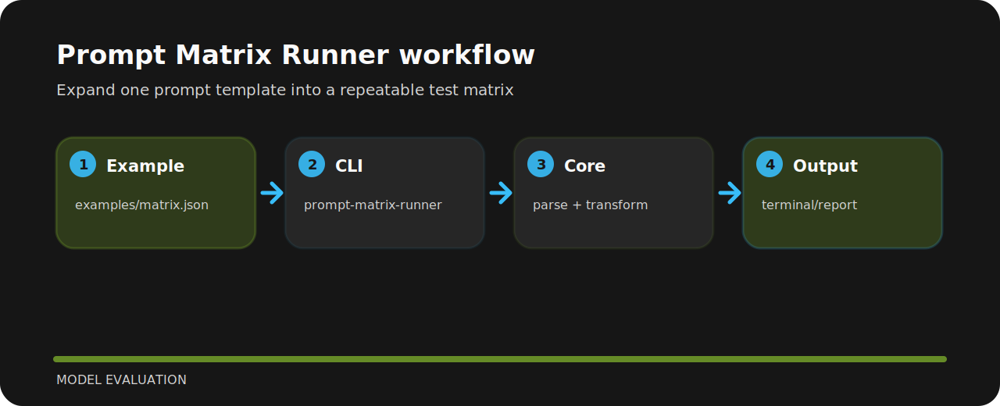

# Prompt Matrix Runner

| Detail | Value |
| --- | --- |
| Area | model evaluation |
| Entry | `prompt-matrix-runner` |
| Input | JSON document |
| Output | readable terminal output |


## What to notice

Expand one prompt template into a repeatable test matrix. It is a compact working note as much as a project: commands, file map, and the reasoning are kept close together.

## Run it

```bash
git clone https://github.com/mertefekurt/prompt-matrix-runner.git
cd prompt-matrix-runner
python -m pip install -e ".[dev]"
prompt-matrix-runner examples/matrix.json --preview
```

## How it runs



## Before a release

```bash
ruff check .
pytest
python -m prompt_matrix_runner --help
```
